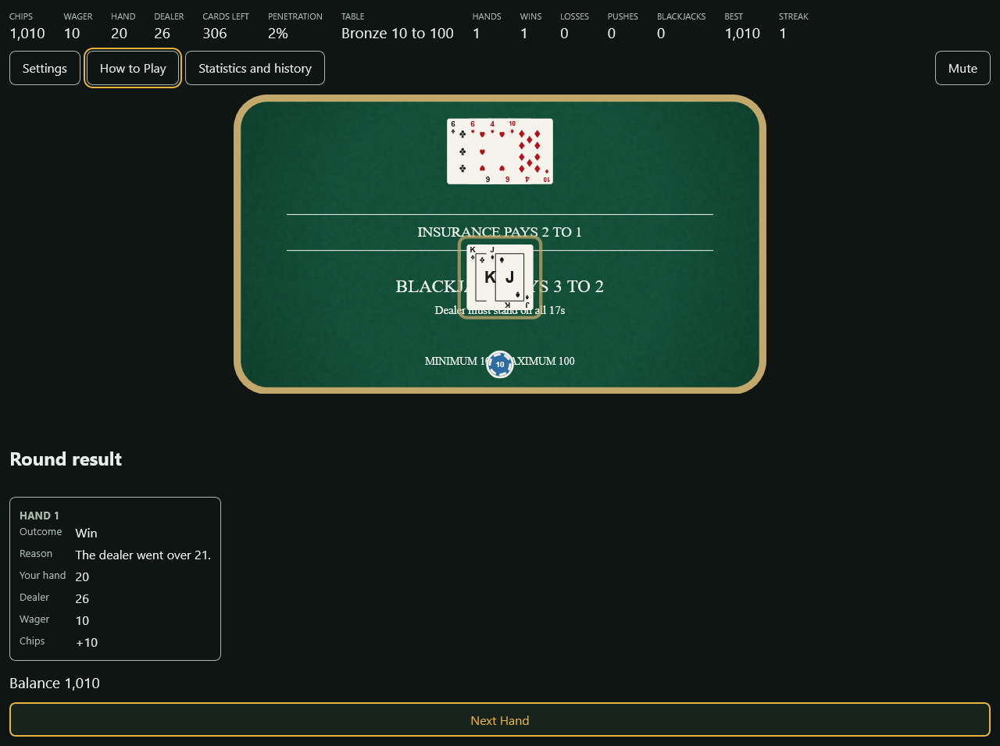
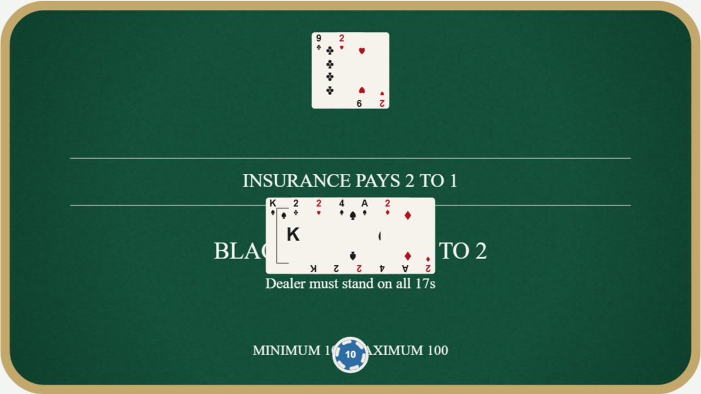
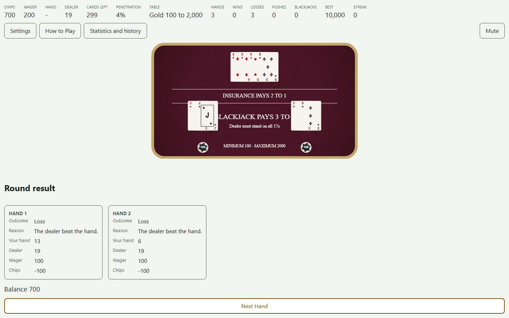
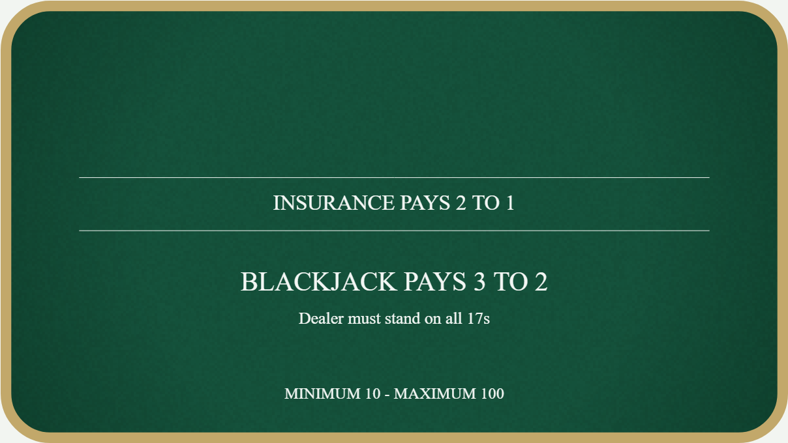
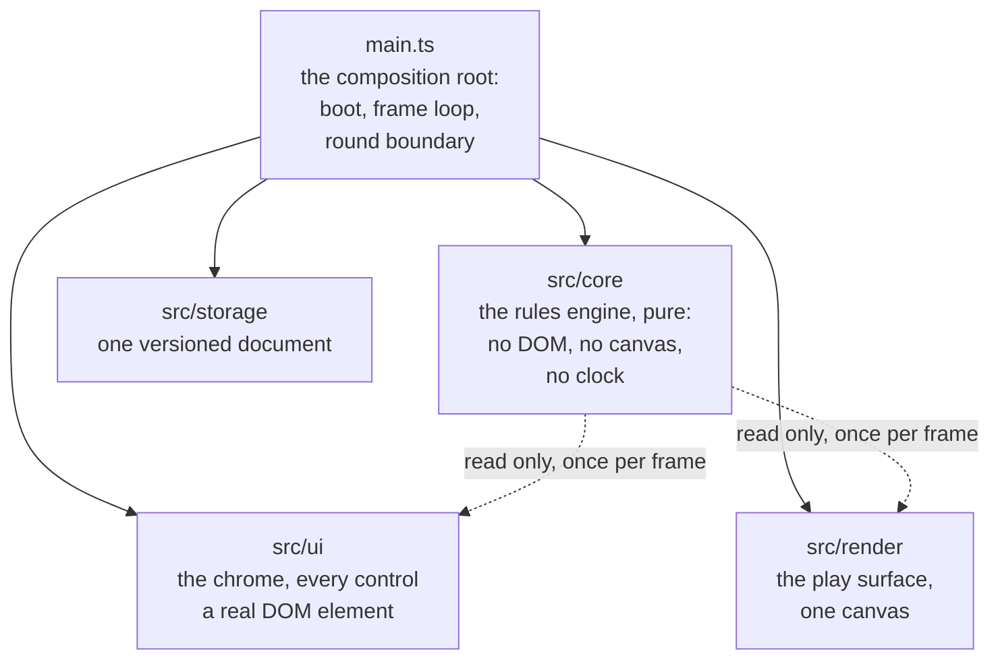
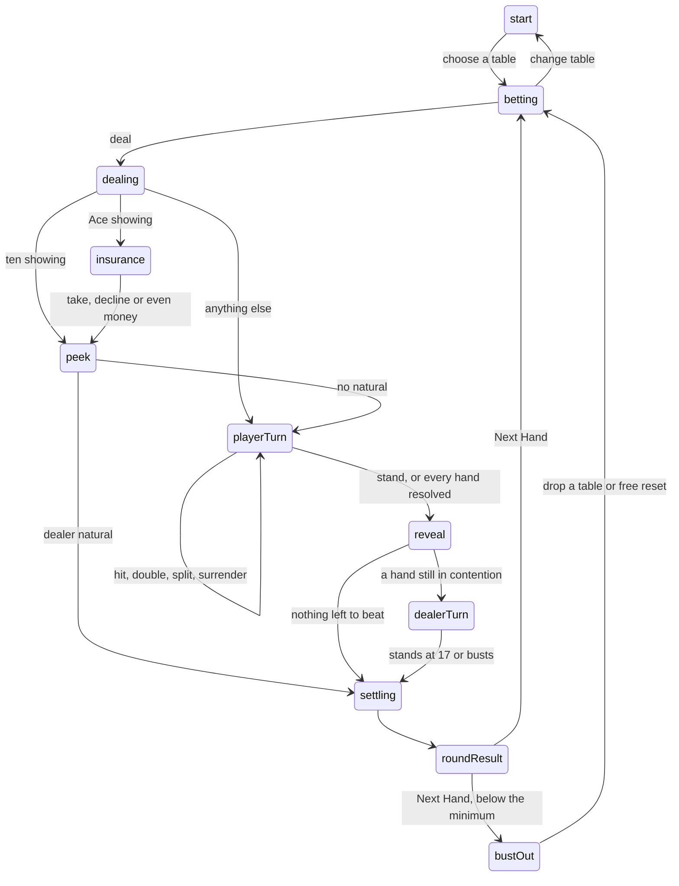
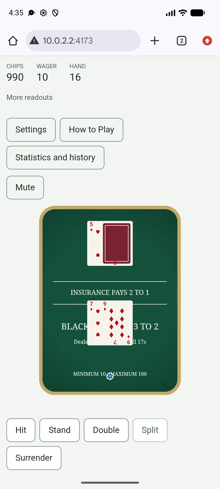
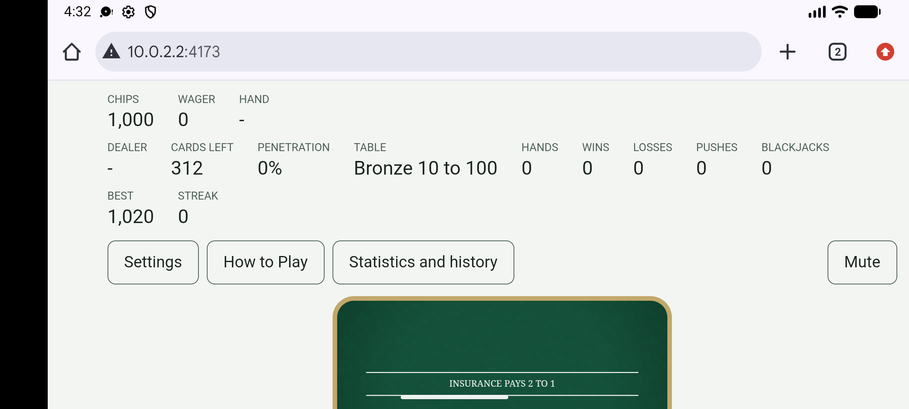

# Blackjack

<p align="center">
  <strong>A complete casino Blackjack game for the browser, built from scratch in TypeScript and
  Canvas 2D with no game framework, no physics engine and no runtime dependencies.</strong>
</p>

<p align="center">
  
</p>

Blackjack is a full implementation of the casino game, not a demonstration slice. It deals from a real six
or eight deck shoe with a cut card, offers every player action the rules allow, settles nine distinct
outcome rungs exactly, keeps a bankroll across three unlockable tables, coaches basic strategy, records
lifetime statistics and a rolling hand history, and remembers all of it between visits.

The engineering constraint is the interesting part. The rules engine is pure TypeScript that cannot see the
DOM, the canvas, the clock or the network. The play surface is drawn on a canvas. Every button, readout,
panel and label is a real DOM element, so the whole interface is reachable by keyboard and readable by a
screen reader. That separation is enforced by lint rules and by tests rather than by convention, and it is
what makes roughly two thirds of the acceptance sheet automatable.

## Highlights

**The game**

- Six or eight deck shoe with a cut card, penetration readout, and a reshuffle that never interrupts a hand
- Hit, stand, double, split to four hands, surrender, insurance and even money, each gated by real legality
- Nine settlement rungs computed as a pure total function, with the deciding rung reported per hand
- Three tables, Bronze, Silver and Gold, unlocked by a lifetime high-water mark rather than by current chips
- Basic-strategy coach in hint or review mode, generated from the live house rules and verified cell by cell
- Eleven milestones, session and lifetime statistics, and a fifty round hand history with a per-round journal
- Everything persists in one namespaced versioned document, sanitised field by field on every read

**The build**

- No runtime dependencies. The shipped bundle is 37.09 KB of JavaScript gzipped against a 40 KB ceiling
- Deterministic build: two builds from one source tree are compared byte for byte on every run
- Seeded random with per-consumer streams, so a recorded seed reproduces a session exactly
- WCAG 2.2 AA targeted and measured against rendered pixels, not asserted in prose
- Reduced motion removes animation entirely without changing the sequence of states or any outcome
- Full keyboard operation, a persistent screen-reader mirror of play state, and forced-colors support

## Visual showcase

<table>
  <tr>
    <td width="33%">
      <a href="docs/images/blackjack-cards.png"></a>
    </td>
    <td width="33%">
      <a href="docs/images/blackjack-chips.png"></a>
    </td>
    <td width="33%">
      <a href="docs/images/blackjack-split-result.png"></a>
    </td>
  </tr>
  <tr>
    <td align="center">Cards at 200 percent</td>
    <td align="center">A 680 wager in chips</td>
    <td align="center">A split, settled per hand</td>
  </tr>
</table>

The felt is baked once per size and blitted, and its printed lines are built from the live table limits
rather than painted in, so the three tables are genuinely different surfaces.

<table>
  <tr>
    <td width="33%">
      <a href="docs/images/blackjack-felt-bronze.png"></a>
    </td>
    <td width="33%">
      <a href="docs/images/blackjack-felt-silver.png"></a>
    </td>
    <td width="33%">
      <a href="docs/images/blackjack-felt-gold.png"></a>
    </td>
  </tr>
  <tr>
    <td align="center">Bronze, 10 to 100</td>
    <td align="center">Silver, 50 to 500</td>
    <td align="center">Gold, 100 to 2,000</td>
  </tr>
</table>

## The game

### House rules

| Rule | Value |
| --- | --- |
| Shoe | 6 or 8 decks, player selectable, with a cut card |
| Blackjack pays | 3 to 2 |
| Dealer | Stands on all 17s, including soft 17 |
| Insurance pays | 2 to 1 |
| Even money | Offered on a player natural against a dealer Ace |
| Double after split | On, player selectable |
| Surrender | Late surrender, on, player selectable |
| Split | Up to four hands, on equal value or on exact rank, player selectable |
| Chip denominations | 10, 50, 100 and 500 |
| Starting bankroll | 1,000 |

Every wager is a multiple of ten, which is why the 3 to 2 natural, the insurance stake, the 2 to 1 insurance
payout and the surrender return are all exact integers. There is no rounding rule anywhere in the game. A
chip tap that would exceed the table maximum is rejected rather than silently clamped.

### The three tables

| Table | Minimum | Maximum | Unlocks at |
| --- | --- | --- | --- |
| Bronze | 10 | 100 | Available from the start |
| Silver | 50 | 500 | A lifetime best balance of 2,500 |
| Gold | 100 | 2,000 | A lifetime best balance of 10,000 |

Tables unlock on the **high-water mark**, not on current chips, so a table already earned is never taken
away by a losing streak. Running out of money at a table offers a drop to any lower table you have unlocked,
or a free reset of the bankroll.

### Progression

The coach grades each decision against a basic-strategy chart generated from the house rules in force, so
changing the shoe size or turning double-after-split off regenerates the chart. Accuracy is reported over
coached decisions only. Eleven milestones award exactly once each, session and lifetime counters run in
parallel, and the last fifty rounds are kept with a journal of the intents accepted in each.

## Architecture

Four layers, one composition root, and one boundary that is enforced rather than encouraged.



**`src/core` imports nothing from `src/render`, `src/ui`, the DOM or the canvas.** A custom ESLint rule
fails the build if it ever does, and a fixture of deliberate violations proves the rule can actually fire.
The rules engine is therefore testable headlessly at whatever speed a test wants, which is how a fifty
thousand round audited soak and a 187 cell phase-legality sweep are practical to run on every commit.

**Chrome is DOM and the canvas is the play surface only.** No button, readout, panel or label is ever drawn
on the canvas. That is what makes the interface reachable by keyboard and by assistive technology at all,
and it removes hand-rolled hit testing entirely: every control is a real `<button>` bound once to `click`.

### How a round flows

SPEC 10's eleven phases. One `apply(intent)` entry point accepts or refuses every intent, and the machine
refuses anything illegal for the current phase rather than trusting the interface to hide it.



### Determinism

Nothing in the game calls `Math.random`. A seeded generator produces every shuffle, and **each independent
consumer gets its own stream** through `split()`, so adding a draw in one place cannot shift the sequence
anywhere else. A recorded seed replays a session exactly, at any frame rate, which is what makes the soak
harnesses and the capture run-sheets reproducible rather than merely repeatable.

All decay and easing is time based, `v *= k ** dt` rather than a fixed step per frame, so behaviour at
30 fps and at 144 fps is identical. The test suite carries a negative control that must detect the wrong
form.

## Responsive layout and input

Four breakpoints resolved by width first, with orientation distinguishing only the two cases below the
medium floor. There are **no media queries**: the breakpoint is resolved in one module against thresholds
pinned to the design contract, so a single source decides layout for both the DOM and the canvas.

| Breakpoint | Range |
| --- | --- |
| `wide` | width >= 1024 px |
| `medium` | width 768 to 1023 px |
| `compact` | width < 768 px, landscape |
| `portrait` | width < 768 px, portrait |

<table>
  <tr>
    <td width="38%">
      <a href="docs/images/blackjack-phone-portrait.png"></a>
    </td>
    <td width="62%">
      <a href="docs/images/blackjack-phone-landscape.png"></a>
    </td>
  </tr>
  <tr>
    <td align="center">Portrait, player turn</td>
    <td align="center">Landscape, full readouts</td>
  </tr>
</table>

Below 768 px the chips, the wager and the hand value stay in view and the rest of the readouts sit one press
behind a top-bar disclosure. Under pressure the card fan compresses to its pitch floor before any card
shrinks, cards then shrink to a 60 px width floor, and past both floors the hand band overflows into a
pannable stage rather than breaking either rule. Safe-area insets are respected, so no control sits under a
notch or a home indicator.

There is no pointer handler anywhere in the game. Every control is a native button bound once to `click`, so
mouse, touch, pen and keyboard parity is structural rather than something that has to be re-tested per input
type.

## Accessibility

Accessibility here is measured, not claimed.

- **A persistent visually hidden mirror** carries the full play state with real semantics: the phase, the
  dealer total, every card by name, per hand, plus chips, wager, table limits and the house rules in force
- **Two live regions**, one polite for incremental change and one assertive for outcomes, with a queue that
  enforces a floor between utterances, coalesces superseded messages and never drops an outcome
- **Full keyboard operation** with focus containment in overlays and focus restored on close. Disabled
  controls stay focusable and carry their refusal reason, so the reason is reachable without a pointer
- **Contrast measured from rendered pixels**, 120 play-surface rows and 12 chrome rows, with zero below
  threshold, including the focus ring and the range track in both themes
- **558 touch targets measured** across every breakpoint and screen, with zero size and zero clearance
  breaches against a 44 px target and 8 px clearance
- **Forced colors** supported with a dedicated high-contrast play-surface palette
- **Reduced motion** removes animation entirely and provably does not change the sequence of states or any
  outcome. The separate Speed setting changes pacing in both motion modes
- **Nothing flashes** more than three times per second, measured on a rolling window at the worst-case
  speed, with a control that proves the counter can detect a breach

An automated axe scan runs over every screen and overlay on every commit, with exactly four documented
exclusions that are themselves asserted to be non-vacuous.

## Technology

- TypeScript 6 in strict mode, ES modules, no runtime dependencies
- Canvas 2D for the play surface, with one device-pixel-ratio backing store and two ordered passes
- Vite 8 for the dev server and the production build
- Vitest 5 for unit and property tests, Playwright 1.63 for browser tests across eight projects
- ESLint 10 with a custom rule enforcing the `core` import boundary
- axe-core 4.13 for automated accessibility scanning, development only
- Node 20.19 or newer

Deliberately rejected: game frameworks, rendering libraries and physics engines. None of them earn their
bytes for a card game whose hardest problem is correctness, not throughput.

## Repository map

| Path | Responsibility |
| --- | --- |
| `src/core/` | The rules engine. Phase machine, shoe, dealer, hands, wallet, settlement, strategy, statistics, history, seeded random. Sees no DOM |
| `src/render/` | The play surface. Canvas setup, felt baking, cards, chips, scene composition, tweens |
| `src/ui/` | Controls as real DOM elements, plus layout, breakpoints, frame loop, announcements, audio, theming |
| `src/ui/components/` | Screens, betting tray, action row, readouts, overlays, round result, mirror, announcer |
| `src/storage/` | One versioned document, per-field sanitising, a migration walk, a guarded store probe |
| `src/main.ts` | The composition root. Boots machine, surface, loop and chrome; owns the round boundary |
| `tests/unit/` | Unit and property tests, including reference implementations written from the spec alone |
| `tests/browser/` | Playwright suites run against the built output across eight browser projects |
| `scripts/` | Determinism check, measurement reports, mutation validation, capture server |
| `packages/engine/` | The extraction surface for the shared engine, kept honest as the game grows |

## Getting started

**Prerequisites.** Node 20.19 or newer, and npm.

```bash
npm ci
```

**Run the game locally.**

```bash
npm run dev
```

Then open the URL Vite prints, by default `http://localhost:5173`. The game boots straight to the table
chooser; no account, no network call and no configuration is involved.

**Build and preview the production bundle.**

```bash
npm run build
npm run preview
```

The build is fully static. The contents of `dist/` can be served by any static host with no server-side
component at all.

### Operating the game

Pick a table, build a wager from the chip tray, and press Deal. Everything is reachable by keyboard: `Tab`
and `Shift+Tab` move between controls, `Enter` and `Space` activate them, and `Escape` closes any overlay
and returns focus to the control that opened it. The play surface itself is a labelled tab stop so a
keyboard user can reach and scroll it when a wide split overflows.

Settings covers the coach mode, speed, play-surface size, the house rules, volume, theme, reduced motion,
and a full reset of stored data. Progress is stored in this browser only and can be cleared from within the
game or by the browser itself.

## Verification

Every gate below except the mutation sweep runs on every pull request, and all of those must be green
before anything reaches `main`. The sweep is the phase gate: it runs locally at each phase close, last
and alone, and never on a pull request. Every gate also runs locally, on a machine with nothing but this
repository, Node and `npm ci`. There is no gate that only exists in CI.

The blocking suite, which is what `npm run verify` chains:

```bash
npm run verify
```

The six measured reports, which grade the numbers rather than the behaviour:

```bash
npm run report:all
```

And the gate that grades the gates, which is deliberately not part of either chain because it takes
hours and rewrites the source while it runs:

```bash
npm run verify:mutations
```

| Gate | What it proves | Current |
| --- | --- | --- |
| `typecheck` | Strict TypeScript across source and tests | Clean |
| `lint` | Style, plus the `core` import boundary, proven by a violating fixture | Clean |
| `test` | Unit and property tests, plus spec-derived reference implementations | 1,375 tests in 60 files |
| `test:browser` | Playwright against the built output, eight browser projects | 2,181 tests, zero skipped |
| `verify:build` | Two adversarial builds compared byte for byte | Reproducible |
| `verify:policy` | Repository, subject and metadata rules over every tracked file | Clean |
| `report:all` | Bundle size, contrast, touch targets, frame timing, Lighthouse, memory | 6 of 6 pass |
| `verify:mutations` | Breaks the source and requires the named gate to go red | 842 ledger entries |

`npm run verify` chains `verify:policy`, `typecheck`, `lint`, `test`, `test:browser` and
`verify:build`. `report:all` and `verify:mutations` are run separately, and the reports need a build
present, so run `npm run build` first if the working tree is fresh.

`verify:mutations` is the gate that grades the other gates. Each entry names one edit to the source and the
gate that must fail because of it. An entry whose gate stays green is a hole in the suite, not a passing
test, and the harness reads each gate's own verdict so that a killed or crashed run is reported rather than
counted as a detection.

### Measured thresholds

Every number below is measured by a script and compared against a stated ceiling, not estimated.

| Measurement | Result | Threshold |
| --- | --- | --- |
| JavaScript, gzipped | 37.09 KB | 40 KB |
| Total transfer, gzipped | 41.56 KB | 60 KB |
| Largest Contentful Paint | 1,082 ms | 1,500 ms |
| Total Blocking Time | 7 ms | 150 ms |
| Retained heap growth over 30 minutes of play | 1,383 KB | 2,048 KB |
| Detached nodes, listeners and timers accumulated | 0 | 0 |
| Contrast rows below threshold | 0 of 132 | 0 |
| Touch target size and clearance breaches | 0 of 558 | 0 |

Reports are written to `artifacts/reports/`, and each one names the build fingerprint it measured, so a
report taken against a stale build is visible as a mismatch rather than believed.

## Repository scope

This repository is the complete game: source, tests, harnesses, measurement scripts and CI configuration. A
fresh clone builds and runs the real thing with `npm ci` and `npm run dev`.

Generated output is excluded on purpose. `dist/`, `coverage/`, `artifacts/reports/`, Playwright's report and
result directories and the determinism check's scratch space are all produced by the commands above rather
than committed.

The written specification, the acceptance criteria and the design documents are maintained alongside the
project and are not part of this source snapshot.

## Licensing

No open-source license is included. Unless a separate written agreement grants permission, the source is
provided for viewing and reference only.
